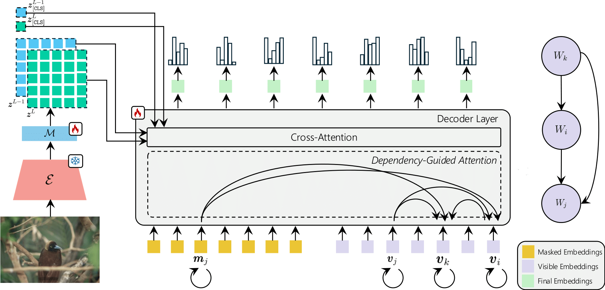

<h1 align="center"> Causal Graphical Models for Vision-Language Compositional Understanding</br></h1>

<div align='center'>

#### [Fiorenzo Parascandolo](https://github.com/FiorenzoParascandolo1)\, [Nicholas Moratelli](https://nicholasmoratelli.github.io)\, [Enver Sangineto](https://aimagelab.ing.unimore.it/imagelab/person.asp?idpersona=144), [Lorenzo Baraldi](https://www.lorenzobaraldi.com/), and [Rita Cucchiara](https://aimagelab.ing.unimore.it/imagelab/person.asp?idpersona=1)

</div>
<p align="center">
   
</p>

## Abstract

Recent work has empirically shown that Vision-Language Models (VLMs) struggle to fully understand the compositional properties of the human language, usually modeling an image caption as a "bag of words". As a result, they perform poorly on compositional tasks, which require a deeper understanding of the different entities of a sentence (subject, verb, etc.) jointly with their mutual relationships in order to be solved. In this paper, we model  the dependency relations among textual and visual tokens using a **Causal Graphical Model (CGM)**, built using a *dependency parser*, and we train a decoder conditioned by the VLM visual encoder. 
Differently from standard autoregressive or parallel predictions,
our decoder's generative process is partially-ordered following the CGM structure. This structure encourages the decoder to learn only the main causal dependencies in a sentence discarding spurious correlations.
Using extensive experiments on five compositional benchmarks, we show that our method significantly outperforms all the state-of-the-art compositional approaches, 
usually by a large margin, and it also improves over  methods trained  using much larger datasets.

## COGT Weights & Metadata
- [Weights](https://drive.google.com/file/d/1zv_Ah-uhw_E9F7MIXFrfrJixAzLBCULn/view?usp=sharing)
- [Metadata](https://drive.google.com/file/d/1S-antIYHtMUqQMmR5ulG7zP7nQQT0yZL/view?usp=sharing)

## Benchmarks 

We evaluate our model on five compositional benchmarks:
- [ARO](https://arxiv.org/pdf/2210.01936)
- [SugarCrepe](https://arxiv.org/pdf/2306.14610)
- [VL-CheckList](https://arxiv.org/pdf/2207.00221)
- [ColorSwap](https://arxiv.org/pdf/2402.04492)

We propose an additional benchmark commonly used to evaluate the ability of open-vocabulary object detectors to discern fine-grained object properties. We use it as a compositional benchmark to challenge models in recognizing attributes of common objects that rarely appear in the image foreground:
- [FG-OVD](https://arxiv.org/pdf/2311.17518)

## Create the environment
```
conda create -y -n "cogt" python=3.9.13
conda activate cogt
pip install -r requirements.txt
```
## Edit some files before running the code based on your local path

To correctly load the model weights and datasets, it is necessary to customize the `PATH` and `TEST_PATH` dictionaries in `paths.py`.

**X-VLM**:
- `'xvlm_weights': 'yourpath/16m_base_model_state_step_199999.th'`
- `'config_xvlm': 'yourpath/Pretrain_XVLM_base_16m.yaml'`
- `'config_swin_xvlm': 'yourpath/config_swinB_224.json'`

**Dataset**:

The dataset metadata includes not only the original annotations from the specific benchmark but also the dependency trees required to construct the attention mask for COGT.

To properly use the datasets, you need to download the benchmark-specific images and customize the `images` entry in the dictionary with the path to the folder containing the images. Similarly, the `metadata` entry should be updated with the path to the corresponding JSON file.

For the proposed FG-OVD benchmark, the images are sourced from the COCO val 2017 dataset.

Example:

```
TEST_PATH = {
    "visual_genome_relation": {'images': 'yourpath/vg_relation_images',
                               'metadata': 'yourpath/visual_genome_relation.json'}}
```

## Training
We train our models on custom COCO split dataset defined by [NegCLIP](https://arxiv.org/pdf/2210.01936).
Use these scripts to train the models:
```
scripts/COGT_X_train.sh
```
 
## Inference
To evaluate our model:
```
scripts/COGT_X_inference.sh
```

